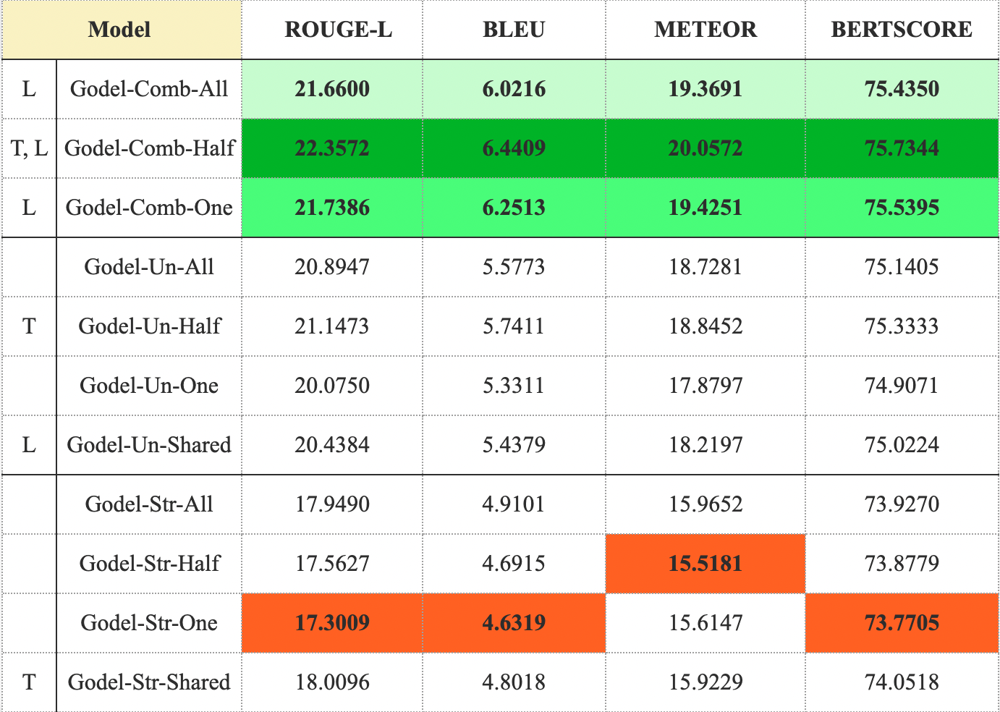
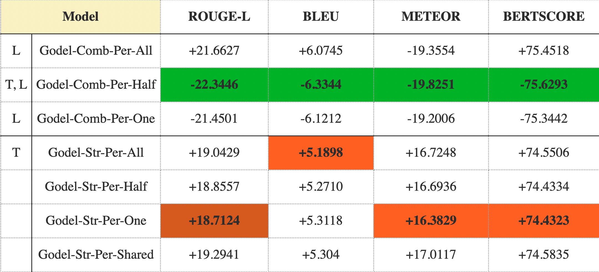

# Exploring the Impact of Structured Dialogue Representation on Dialogue Response Generation

## Introduction

**Goal**  
Our primary goal is to explore the impact of structured dialogue representation on the dialogue response generation task. To achieve our main goal, we comparatively investigate the effect of different qualitative and quantitative scenarios for representing dialogue history on the predicted dialogue responses. 

**Scenarios**  
The qualitative scenarios determine the representation TYPE of the dialogue history, distinguished into the following 3 categories.
1. STRUCTURED: The dialogue history is represented only in the form of graph triples.
2. UNSTRUCTURED: The dialogue history is represented as raw dialogue text.
3. COMBINED: The dialogue history is represented both in a structured (i.e., graph triples) and an unstructured manner (i.e., raw dialogue text).

The quantitative scenarios determine the AMOUNT of dialogue history used to train the model and predict each turn, and are distinguished into 4 categories:
1. ALL: All of the past turns are included in the dialogue history.
2. HALF: Half of the past turns are included in the dialogue history.
3. ONE: The most recent turn is included in the dialogue history.
4. SHARED: The most recent turn and any preceding turns that share at least one entity with it are included in the dialogue history.

**Methodology**  
- We generate dialogue responses by employing GODEL [(Peng et al., 2022)](#godel2022), a goal-directed transformer-based language model. (for more information on Godel, please visit the model's github page [here](https://github.com/microsoft/GODEL).)  
- We finetune Godel on the OpenDialKg dataset [(Moon et al., 2019)](#opendialkg), composed by 15K human crowd-sourced goal-driven dialogues on the topics of sports, music, books and music, where each turn is annotated graph triples representing factual knowledge.  
- We finetune 11 models (see below) corresponding to the 11 quantitative and qualitative scenarios for representing the dialogue history of each turn.  
  
- Finally, given that the graphical representation of the dialogue history encapsulates solely factual information, we extract additional perspectival information (i.e., dialogue acts and emotions)from each turn and represent it as graph triples appended to the existing factual triples. Once more, we represent the enhanced dialogue history of each turn based on the different quantitative and qualitative scenarios and retrain the above models on the modified input (see below). Note that this time, we train only the models including structured dialogue information (i.e., triples), since perspective is only represented graphically.
  
- We evaluate the quality of responses using the standardized metrics, [ROUGE](#lin2004rouge), [BLUE](#papineni2002bleu), [METEOR](#banerjee2005meteor) and [BERTSCORE](#zhang2019bertscore).
- A also conduct a manual evaluation on the predictions using 10 criteria inspired by the principles of the Gricean Maxims. Please find the individual criteria and the annotation guidelines [here](./evaluation/manual/annotation_guidelines.pdf)

**Results**
Evaluating the finetuned models on the automatic metrics we observe that combining a structured with an unstructured representation of the dialogue history (i.e., the COMBINED qualitative scenario) yields the best model performance (see Figure 3)  
<figure>
  
  <figcaption>Figure 3. Performance of the models without perspective triples: RougeL, Bleu, Meteor and f1 BERTScore of the 11 models trained and evaluated on the 11 different qualitative and quantitative scenarios. For every metric the highest scores across models are displayed in green from darker (1st best score) to lighter (3rd best score), while the lowest score is displayed in red. The letter “T” preceding some models on the left-side of the table indicates the best performing model across the quanTitative input scenarios (eg. Godel-Comb-Half outperforms Godel-Comb-One and Godel-Comb-All). The letter "L" indicates the best performing model across the quaLitative input scenarios (eg. Godel-Comb-Half outperforms Godel-Un-Half and Godel-Str-Half).</figcaption>
</figure>). 

In addition, adding perspectival information significantly improves performance for the models implementing the STRUCTURED qualitative scenario (i.e., Godel-Str-Per). There is no considerable difference in the performance of the models trained on the COMBINED qualitative scenario (i.e., Godel-Comb-Per). Any slight differences might be a result of stochastic training.  
<figure>
  
  <figcaption>Figure 4. Performance of the models with perspective triples: RougeL, Bleu, Meteor and f1 BERTScore of the 7 models trained and evaluated on the 11 different qualitative and quantitative scenarios. For every metric the highest scores across models are displayed in green from darker (1st best score) to lighter (3rd best score), while the lowest score is displayed in red. The letter “T” preceding some models on the left-side of the table indicates the best performing model across the quanTitative input scenarios (eg. Godel-Comb-Per-Half outperforms Godel-Comb-Per-One and Godel-Comb-Per-All). The letter "L" indicates the best performing model across the quaLitative input scenarios (eg. Godel-Comb-Per-Half outperforms Godel-Un-Per-Half and Godel-Str-Per-Half).</figcaption>
</figure>). 

## References

Peng, B., Galley, M., He, P., Brockett, C., Liden, L., Nouri, E., Yu, Z., Dolan, B., Gao, J. (2022). *GODEL: Large-Scale Pre-training for Goal-Directed Dialog*. [arXiv](https://www.microsoft.com/en-us/research/publication/godel-large-scale-pre-training-for-goal-directed-dialog/).

Moon, S., Shah, P., Kumar, A., Subba, R. (2019). *OpenDialKG: Explainable Conversational Reasoning with Attention-based Walks over Knowledge Graphs*. In *Proceedings of the 57th Annual Meeting of the Association for Computational Linguistics*. [Link to Paper](https://aclanthology.org/P19-1081.pdf)

Lin, C.-Y. (2004). *ROUGE: A Package for Automatic Evaluation of Summaries*. In *Text Summarization Branches Out*. [Link to Paper](https://aclanthology.org/W04-1013), pp. 74-81.

Papineni, K., Roukos, S., Ward, T., Zhu, W.-J. (2002). *BLEU: A Method for Automatic Evaluation of Machine Translation*. In *Proceedings of the 40th Annual Meeting of the Association for Computational Linguistics*. [Link to Paper](https://aclanthology.org/P02-1040.pdf), pp. 311-318.

Banerjee, S., Lavie, A. (2005). *METEOR: An Automatic Metric for MT Evaluation with Improved Correlation with Human Judgments*. In *Proceedings of the ACL Workshop on Intrinsic and Extrinsic Evaluation Measures for Machine Translation and/or Summarization*. [Link to Paper](https://aclanthology.org/W05-0909.pdf), pp. 65-72.

Zhang, T., Kishore, V., Wu, F., Weinberger, K. Q., Artzi, Y. (2019). *Bertscore: Evaluating Text Generation with BERT*. In *arXiv preprint arXiv:1904.09675*. [Link to Paper](https://arxiv.org/pdf/1904.09675.pdf).

